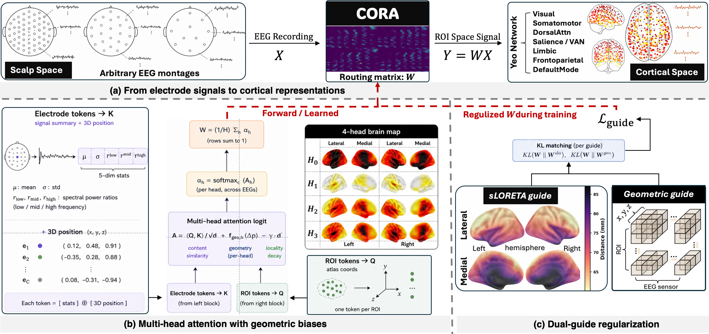
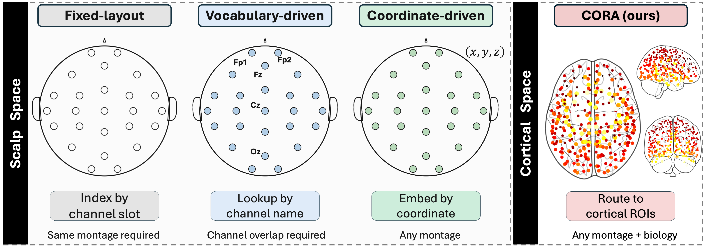
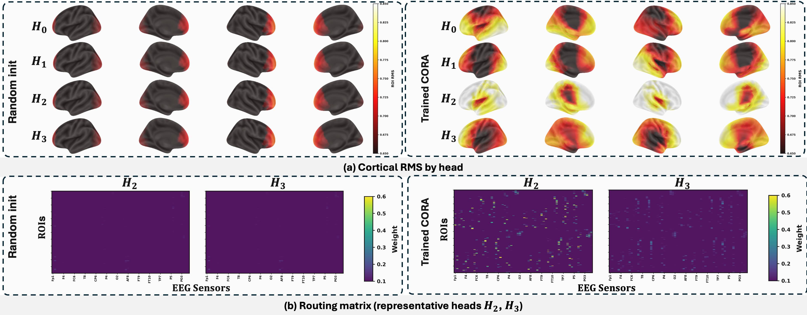
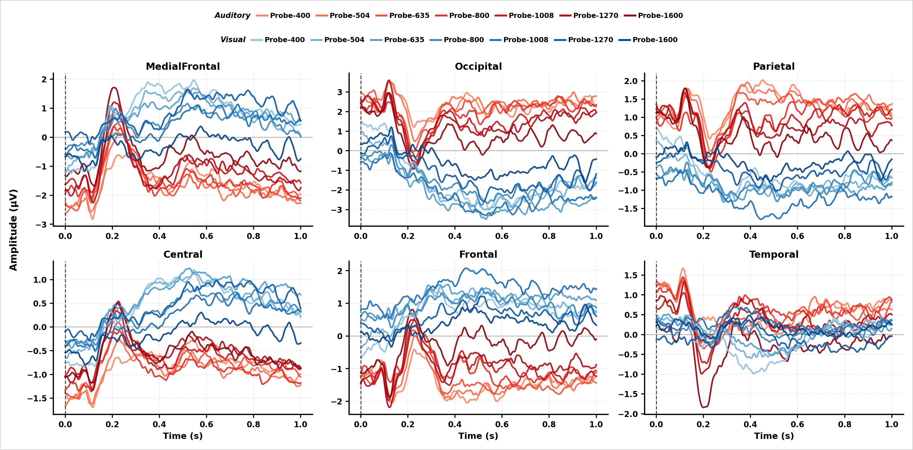
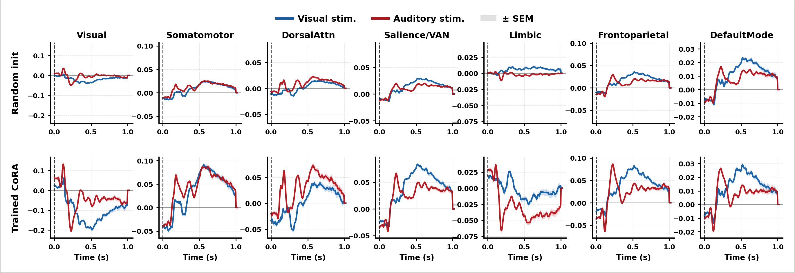

# CORA: Coordinate-Aware ROI Attention for EEG Representation Learning in Cortical Space

*Anonymous code release — NeurIPS 2026 submission.*

<p align="center"></p>

CORA learns EEG representations directly in **cortical (ROI) space** through coordinate-aware attention guided by an sLORETA prior, rather than on raw scalp electrodes.

---

## Repository

```
CORA/
├── main.py                        # SSL pretraining entry
├── linear_probe.py                # frozen-backbone downstream eval
├── compute_sloreta_guide.py       # build sLORETA guide W
├── environment.yml
├── src/
│   ├── model/
│   │   ├── backbone.py            # CORABackbone (temporal encoder)
│   │   └── cora_adapter.py        # coordinate-aware ROI attention
│   ├── experiments/
│   │   ├── Reconstruction.py      # SSL pretraining loop
│   │   └── Classification.py      # linear-probe loop
│   ├── utility/
│   │   ├── data_loader.py
│   │   ├── data_loader_speller.py
│   │   └── loss_mask.py
│   ├── data/
│   │   ├── Generate_XY_zscore.py  # build train/test splits
│   │   ├── plot_erp.py
│   │   └── erp_plot_utils.py
│   └── resources/
│       ├── atlas/                 # Schaefer-100 / 300, W_sloreta
│       └── montages/              # electrode coords
└── figures/
```

---

## Why cortical space?

<p align="center"></p>

Prior EEG SSL operates on scalp electrodes — a montage-specific, anatomically ambiguous basis. CORA reprojects electrodes onto a fixed ROI atlas through learned attention, giving a representation that is **anatomically meaningful** and **transferable across montages**.

---

## Coordinate-aware multi-head attention

<p align="center"></p>

Each head specializes to a distinct cortical pattern; spatial coordinates condition the attention, so the same ROI is reached from any electrode layout.

---

## ERP: scalp vs. ROI

<p align="center">
  
  
</p>

Left: scalp-space ERPs (auditory/visual onset). Right: ROI-space ERPs over the Yeo-7 networks — sharper, more network-localized components.

---

## Installation

```bash
conda env create -f environment.yml
conda activate cora
```